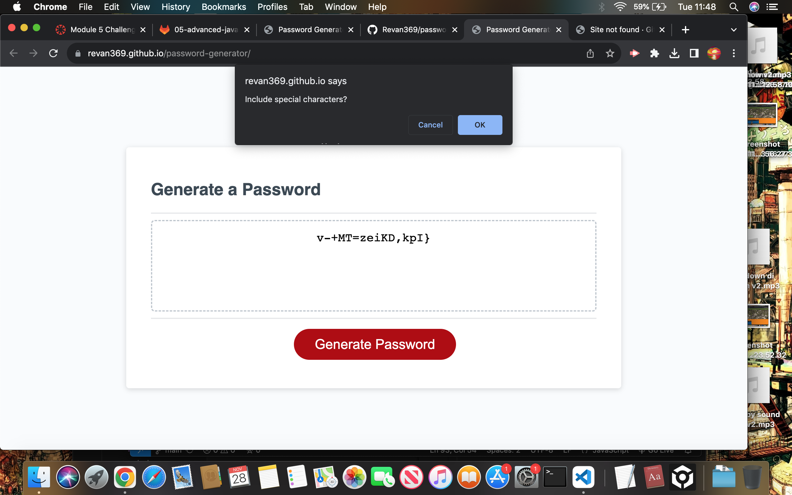

# Password Generator

## Overview

This repository contains a simple web application for generating random passwords based on user-specified criteria. The application runs in the browser and features a clean and responsive user interface.

## Features

- **Password Length:** Users can specify the length of the password (between 8 and 128 characters).
- **Character Types:** Users can choose to include special characters, numeric characters, lowercase letters, and uppercase letters in the generated password.
- **Error Handling:** The application validates user inputs and ensures that at least one character type is selected.
- **Clean UI:** The user interface is designed to be intuitive and responsive, adapting to multiple screen sizes.

## How to Use

1. Open the `index.html` file in a web browser.
2. Click the "Generate Password" button.
3. Follow the prompts to specify your password criteria.
4. View the generated password on the page.

## Screenshots

## Technologies Used

- HTML
- CSS
- JavaScript

## Link to deployed application

https://revan369.github.io/password-generator/
